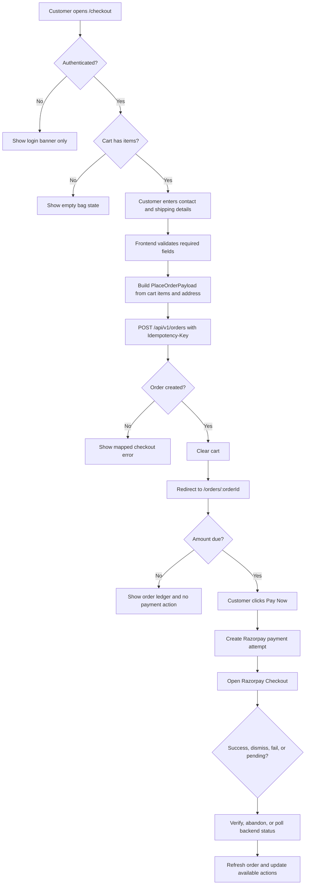

# Eco Caret Checkout And Order Workflow

This document explains the implemented customer checkout, order, payment, cancellation, return, refund, shipment, invoice, and order-status workflow in the Eco Caret frontend.

It is written from the current frontend implementation in:

- `app/checkout/page.tsx`
- `app/orders/page.tsx`
- `app/orders/[id]/page.tsx`
- `services/api.ts`
- `hooks/useRazorpayPayment.ts`
- `lib/razorpayCheckout.ts`
- `lib/paymentStatusRules.ts`
- `types/api.ts`

## Summary

Checkout does not complete payment directly on the `/checkout` page. The frontend first creates an authenticated order through the backend, clears the cart after a successful order creation, and redirects the customer to the order detail page. Payment is then handled from the order detail page through the `Pay Now` action.

This split is intentional:

- `/checkout` collects customer shipping details and creates the order.
- `/orders/:id` is the order ledger and payment recovery page.
- Razorpay payment attempts are created against an existing order.
- Payment success, dismissal, failure, pending reconciliation, cancellation, returns, refunds, shipments, invoice download, and timeline events are all driven from the order detail page.

## Current User Flow



## Checkout Page Behavior

Route: `/checkout`

Source: `app/checkout/page.tsx`

### Authentication Gate

The checkout page checks whether the customer is authenticated using:

- Redux profile user
- Redux profile token
- `localStorage.getItem("eco_caret_token")`

If the customer is not logged in, the page shows only the login banner and does not show the checkout form, order summary, or place-order button.

The login banner tells the customer to sign in before checkout so inventory can be reserved and payment can be verified securely.

### Empty Cart State

If the cart is empty, checkout shows an empty bag state with a link back to `/collections`.

No order API call is allowed when the cart is empty.

### Checkout Form Sections

The checkout form currently collects:

| Section | Fields | Notes |
| --- | --- | --- |
| Contact | Email | Defaults from `user.email` when present |
| Shipping | First name, last name, street address, city, postal code, country, phone | Required before order creation |
| Saved address cards | Profile shipping addresses | Selecting a saved address fills the form |
| Order summary | Cart items, subtotal, tax, shipping, total | Display-side summary only |

### Validation Rules

Before submitting, the frontend requires:

| Field | Requirement |
| --- | --- |
| Email | Required from form or logged-in user profile |
| First name | Required |
| Last name | Required |
| Street address | Required |
| City | Required |
| Postal code | Required |
| Phone | Required |

If validation fails, the page scrolls to the first invalid field.

### Display Pricing

The checkout page currently shows a local display summary:

| Value | Current frontend calculation |
| --- | --- |
| Subtotal | Sum of `cartItem.price * cartItem.quantity` |
| Tax | `subtotal * 0.08` |
| Shipping | Free when subtotal is greater than 5000 or cart is empty, otherwise 50 |
| Total | `subtotal + tax + shipping` |

Important: backend order totals are the source of truth after order creation. The checkout summary is a customer-facing preview and should not be treated as the canonical ledger.

## Cart Item To Order Item Mapping

Checkout maps each cart item into the backend order item input.

Current cart item id format is parsed as:

```ts
const parts = item.id.split("-");
const productId = parts[0];
const purity = parts[1];
const metalColor = parts[2];
const size = parts.slice(3).join("-");
```

The frontend derives `metalType` from `purity`:

| Purity text | Derived `metalType` |
| --- | --- |
| Contains `k` or `gold` | `gold` |
| Contains `925` or `silver` | `silver` |
| Contains `pt`, `950`, or `platinum` | `platinum` |
| Anything else | `gold` |

Order item payload shape:

```ts
{
  productId: string;
  metalType: string;
  metalColor: string;
  purity: string;
  size: string;
  quantity: number;
}
```

## Address Mapping

Checkout builds one address object and sends it as both shipping and billing address.

```ts
{
  name: `${firstName} ${lastName}`,
  line1: address,
  city,
  state: city,
  postalCode,
  country,
  phone
}
```

Country names are mapped to backend country codes:

| UI country | API country |
| --- | --- |
| United Kingdom | `GB` |
| United States | `US` |
| Belgium | `BE` |
| France | `FR` |
| Germany | `DE` |

## Place Order API

Service: `placeOrder()` in `services/api.ts`

Endpoint:

```http
POST /api/v1/orders
Authorization: Bearer <token>
Idempotency-Key: <uuid>
Content-Type: application/json
```

Payload:

```json
{
  "items": [
    {
      "productId": "product-id",
      "metalType": "gold",
      "metalColor": "yellow",
      "purity": "18k",
      "size": "7",
      "quantity": 1
    }
  ],
  "shippingAddress": {
    "name": "Test User",
    "line1": "1 Example Street",
    "city": "London",
    "state": "London",
    "postalCode": "W8 4PX",
    "country": "GB",
    "phone": "+44 20 0000 0000"
  },
  "billingAddress": {
    "name": "Test User",
    "line1": "1 Example Street",
    "city": "London",
    "state": "London",
    "postalCode": "W8 4PX",
    "country": "GB",
    "phone": "+44 20 0000 0000"
  }
}
```

Success response expected by frontend:

```ts
{
  success: true;
  data: {
    id: string;
    orderNumber: string;
    status: string;
    paymentStatus: string;
    fulfillmentStatus: string;
    totalAmount: number;
    currency: string;
    reservationExpiresAt?: string;
    version: number;
  };
}
```

On success:

1. Checkout clears the idempotency key state.
2. Checkout dispatches `clearCart()`.
3. Checkout redirects to `/orders/${result.data.id}`.

## Checkout Idempotency

Checkout stores an in-component `idempotencyKey`.

Rules:

- If there is no key, the frontend generates a UUID.
- The key is sent as `Idempotency-Key` when creating the order.
- The same key is reused for a retry of the same checkout submission.
- On successful order creation, the key is cleared.
- On `ORDER_IDEMPOTENCY_MISMATCH`, the frontend generates a new key and asks the customer to retry.

## Checkout Error Handling

Checkout handles known order creation failures:

| Error signal | Frontend behavior |
| --- | --- |
| `ORDER_IDEMPOTENCY_IN_PROGRESS` | Alert: request is being processed |
| `ORDER_INVENTORY_CONFLICT` | Alert: item unavailable, then route to `/cart` |
| `ORDER_IDEMPOTENCY_MISMATCH` | Generate a new key and ask customer to retry |
| Missing auth token | Open sign-in/profile dialog |
| Any other error | Show the error message or generic order error |

## Order Detail Page

Route: `/orders/:id`

Source: `app/orders/[id]/page.tsx`

The order detail page is the central customer ledger. It loads and displays:

- Order header and order number
- Fulfillment status
- Payment status
- Ledger version
- Order items
- Totals and amount due
- Payment action
- Order actions
- Shipments
- Return requests
- Timeline events
- Invoice download

The page fetches:

| Data | API function | Endpoint |
| --- | --- | --- |
| Order details | `getOrderById(id)` | `GET /api/v1/orders/:id` |
| Timeline events | `getOrderEvents(id)` | `GET /api/v1/orders/:id/events` |
| Shipments | `getOrderShipments(id)` | `GET /api/v1/orders/:id/shipments` |
| Returns | `listOrderReturns(id)` | `GET /api/v1/orders/:id/returns` |
| Invoice | `getOrderInvoice(id)` | `GET /api/v1/orders/:id/invoice` |

## Payment Entry Point

Payment is not opened during checkout submission. Payment is opened from `/orders/:id` when `Pay Now` is available.

The button is available only when:

- `amountDueMinor > 0`
- payment status is not blocked
- payment is not in review
- reservation is not expired
- order is not fully cancelled
- payment hook is not busy
- payment hook is not polling
- payment hook is not reconciling a prior attempt

Blocked payment statuses include:

| Status | Meaning |
| --- | --- |
| `paid` | Payment already complete |
| `not_required` | No payment required |
| `refund_pending` | Refund flow is active |
| `partially_refunded` | Partial refund has happened |
| `refunded` | Refund complete |
| `disputed` | Payment dispute state |
| `cancelled` | Payment/order cancellation state |
| `review_required` | Manual support review needed |

## Payment Attempt Creation

Service: `createOrderPayment()`

Endpoint:

```http
POST /api/v1/orders/:orderId/payments
Authorization: Bearer <token>
Idempotency-Key: <payment-attempt-key>
Content-Type: application/json
```

Payload:

```json
{
  "channel": "web",
  "returnPath": "order-status",
  "provider": "razorpay"
}
```

The frontend stores a payment session in `sessionStorage`:

```ts
eco_caret_razorpay_attempt_<orderId>
```

Stored values:

```ts
{
  key: string;
  paymentId: string;
}
```

Important identifier rule:

| Identifier | Meaning | Used for |
| --- | --- | --- |
| `payment.id` | Internal backend payment id | Frontend API URLs for verify, status, abandon |
| `providerOrderId` | Razorpay order id from backend client action | Razorpay Checkout `order_id` |
| `razorpay_payment_id` | Provider payment id returned by Razorpay success callback | Verification payload only |
| `razorpay_signature` | Provider signature returned by Razorpay success callback | Verification payload only |

The frontend must never send `providerOrderId` or `razorpay_payment_id` in place of the internal backend payment id.

## Razorpay Checkout

Source: `lib/razorpayCheckout.ts`

The helper loads:

```text
https://checkout.razorpay.com/v1/checkout.js
```

Checkout options include:

```ts
{
  key: action.keyId,
  order_id: action.providerOrderId,
  amount: action.amountMinor,
  currency: action.currency,
  name: action.merchantName,
  description,
  prefill,
  handler,
  modal: {
    confirm_close: true,
    ondismiss
  },
  theme: {
    color: "#3C9984"
  }
}
```

The helper can resolve:

| Result | Meaning |
| --- | --- |
| `success` | Razorpay success callback returned payment confirmation fields |
| `dismissed` | Customer closed the checkout modal |
| `failed` | Razorpay emitted `payment.failed` |

## Razorpay Success Flow

When Razorpay returns success:

1. `paymentCallbackStartedRef.current = true` is set immediately.
2. The abandon flow is blocked.
3. The frontend sends verification to the backend.

Endpoint:

```http
POST /api/v1/orders/:orderId/payments/:paymentId/verify-razorpay
Authorization: Bearer <token>
Content-Type: application/json
```

Payload:

```json
{
  "razorpayOrderId": "order_xxx",
  "razorpayPaymentId": "pay_xxx",
  "razorpaySignature": "signature_xxx"
}
```

If verification returns:

| Status | Frontend behavior |
| --- | --- |
| `paid` | Stop polling, clear stored attempt, refresh order, show success |
| `created`, `requires_action`, `processing`, `authorized`, `unknown`, `review_required` | Keep payment retry disabled and poll status |
| `failed`, `cancelled`, `expired` | Stop polling, clear stored attempt, refresh order, allow retry if order still needs payment |

## Razorpay Dismissal Flow

Dismissal is not treated as payment failure.

When the customer closes the Razorpay Checkout modal:

1. The checkout helper calls the hook dismiss callback.
2. The hook returns immediately if there is no internal payment id.
3. The hook returns immediately if success callback has already started.
4. The hook returns immediately if abandonment has already started.
5. The hook sets UI status to reconciling.
6. The hook shows:

```text
Payment window closed. We're checking your payment status.
```

7. The hook calls the backend abandon endpoint with the internal payment id.

Endpoint:

```http
POST /api/v1/orders/:orderId/payments/:paymentId/abandon
Authorization: Bearer <token>
Idempotency-Key: payment-abandon:<paymentId>
Content-Type: application/json
```

Body:

```json
{}
```

Response can be `200` or `202`.

| Response | Frontend behavior |
| --- | --- |
| `200` and terminal status | Process status immediately |
| `200` and non-terminal status | Keep retry/cancellation disabled and poll |
| `202` | Start polling because provider reconciliation is pending |
| Error | Do not mark failed locally; show warning and start polling when possible |

Error message for abandon failure:

```text
We could not confirm the payment status yet. Please wait or check your order status.
```

## Payment Polling

Polling uses existing payment status endpoint:

```http
GET /api/v1/orders/:orderId/payments/:paymentId
Authorization: Bearer <token>
```

Implementation rules:

- Polls every 2.5 to 3 seconds.
- Maximum duration is 60 seconds.
- Uses `AbortController` for in-flight status request cleanup.
- Prevents overlapping status requests.
- Stops timers and aborts request on cleanup/unmount.
- Stops immediately when a terminal or paid state is received.

Pollable statuses:

| Status | Frontend behavior |
| --- | --- |
| `created` | Keep retry/cancellation disabled, continue polling |
| `requires_action` | Keep retry/cancellation disabled, continue polling |
| `processing` | Keep retry/cancellation disabled, continue polling |
| `authorized` | Keep retry/cancellation disabled, continue polling |
| `unknown` | Keep retry/cancellation disabled, continue polling |
| `review_required` | Keep retry/cancellation disabled, continue polling |

Terminal retry statuses:

| Status | Frontend behavior |
| --- | --- |
| `failed` | Stop polling, clear stored payment attempt, refresh order, retry can be shown if order still needs payment |
| `cancelled` | Stop polling, clear stored payment attempt, refresh order, retry can be shown if order still needs payment |
| `expired` | Stop polling, clear stored payment attempt, refresh order, retry can be shown if order still needs payment |

Paid status:

| Status | Frontend behavior |
| --- | --- |
| `paid` | Stop polling, clear stored payment attempt, refresh order, continue successful-payment flow |

Polling timeout message:

```text
Payment verification is taking longer than expected. Check your order status before retrying.
```

After timeout:

- Payment is kept in a non-terminal frontend state.
- Payment retry is not enabled solely because polling timed out.
- The customer can use the manual `Check payment status` action.

## Manual Payment Status Check

The order detail page shows `Check payment status` when:

- There is a current payment.
- The hook is reconciling.
- Polling is not currently active.

The action calls `getOrderPayment(orderId, paymentId)` through the hook and re-enters polling if the status is still non-terminal.

## Payment And Cancellation Locking

While payment is busy, polling, or reconciling:

- `Pay Now` is disabled.
- Customer cancellation is disabled.
- The UI shows that cancellation is paused while payment status is being verified.

This prevents the customer from starting a new payment attempt or cancelling the order while a previous payment attempt may still become paid.

## Order List Page

Route: `/orders`

The order list page loads customer orders and links each order to `/orders/:id`.

It is the customer entry point for:

- Viewing current order status
- Resuming payment from order detail
- Checking shipment and timeline
- Downloading invoices
- Starting cancellation or return from detail page

## Order Timeline

The order detail page loads timeline events from:

```http
GET /api/v1/orders/:id/events
```

The UI displays a concise order history. Events are loaded in reverse order for customer readability.

Pagination uses:

| Param | Meaning |
| --- | --- |
| `afterSequence` | Cursor for additional event pages |
| `limit` | Backend page size |

## Shipments

Shipments are loaded from:

```http
GET /api/v1/orders/:id/shipments
```

Shipment details can include:

- Shipment number
- Carrier
- Service
- Tracking number
- Tracking URL
- Status
- Shipped date
- Estimated delivery
- Delivered date
- Shipment item quantities

Shipment item ids are matched to order items using `item.id || item._id`.

## Invoice Download

Invoice download calls:

```http
GET /api/v1/orders/:id/invoice
```

The response is requested as a `blob`. The frontend creates a temporary download URL and triggers a file download.

## Customer Cancellation

Cancellation is available when the order has cancellable unshipped quantities.

Frontend quantity rule:

```ts
ordered - cancelled - shipped
```

Cancellation payload:

```json
{
  "reason": "Customer requested cancellation",
  "expectedVersion": 12,
  "items": [
    {
      "orderItemId": "order-item-id",
      "quantity": 1
    }
  ]
}
```

Endpoint:

```http
POST /api/v1/orders/:id/cancellations
Authorization: Bearer <token>
Idempotency-Key: <stable-cancel-key>
Content-Type: application/json
```

If the selected cancellation covers every unshipped item and no items have shipped, the frontend may omit `items` to request full unshipped cancellation.

Cancellation is blocked while payment is being verified.

Known cancellation conflict handling:

| Backend code | Frontend behavior |
| --- | --- |
| `ORDER_VERSION_CONFLICT` | Refresh order workflow and ask customer to retry |
| `ORDER_RESERVATION_RELEASE_CONFLICT` | Refresh order workflow |
| `ORDER_SHIPMENT_QUANTITY_CONFLICT` | Refresh order workflow |
| `ORDER_RETURN_REQUIRED` | Tell customer to use Request Return for shipped items |
| `PAYMENT_CANCELLATION_REQUIRED` | Tell customer an active payment attempt must finish or expire |
| `PAYMENT_VOID_REQUIRED` | Tell customer payment authorization must be released before cancellation |

## Customer Return Request

Return is available when shipped quantities are returnable.

Return base quantity:

```ts
shipped - returned
```

The frontend also subtracts outstanding active return quantities.

Return payload:

```json
{
  "expectedOrderVersion": 12,
  "reason": "Size issue",
  "items": [
    {
      "orderItemId": "order-item-id",
      "quantity": 1
    }
  ]
}
```

Endpoint:

```http
POST /api/v1/orders/:orderId/returns
Authorization: Bearer <token>
Idempotency-Key: <stable-return-key>
Content-Type: application/json
```

Return request notes:

- Customer must select at least one returnable quantity.
- Customer must provide a reason.
- Return requests are reviewed after warehouse receipt and inspection.
- Refunds are not immediate.
- Return item ids use `item.id || item._id` for API compatibility.

## Return Statuses

The order detail page maps return statuses to customer labels:

| Status | Label |
| --- | --- |
| `return_requested` | Return requested |
| `return_in_transit` | Return in transit |
| `return_received` | Received by warehouse |
| `inspection_approved` | Inspection approved |
| `inspection_rejected` | Inspection rejected |
| `refund_processing` | Refund processing |
| `refunded` | Refund completed |
| `return_rejected` | Return rejected |
| `cancelled` | Return cancelled |

Active return statuses that reduce returnable quantity:

- `return_requested`
- `return_in_transit`
- `return_received`
- `inspection_approved`
- `refund_processing`

## Refund Status Labels

Refund statuses are shown for cancellations and returns.

Cancellation refund statuses:

| Status | Meaning |
| --- | --- |
| `not_required` | No refund required |
| `refund_pending` | Refund pending |
| `partially_refunded` | Partial refund completed |
| `refunded` | Refund completed |
| `review_required` | Manual review required |

Return refund statuses:

| Status | Meaning |
| --- | --- |
| `not_eligible` | Refund not eligible |
| `refund_pending` | Refund pending |
| `partially_refunded` | Partial refund completed |
| `refunded` | Refund completed |
| `review_required` | Manual review required |

## Order And Payment Status Fields

The frontend expects order data to include:

```ts
{
  id: string;
  orderNumber: string;
  status: string;
  fulfillmentStatus: string;
  paymentStatus: string;
  version: number;
  totals: {
    amountDueMinor: number;
    currency: string;
  };
  items: OrderItem[];
  createdAt: string;
  updatedAt: string;
}
```

Payment status type:

```ts
type PaymentStatus =
  | "created"
  | "requires_action"
  | "processing"
  | "authorized"
  | "paid"
  | "failed"
  | "cancelled"
  | "expired"
  | "unknown"
  | "review_required";
```

## Frontend Recovery Rules

The frontend is designed to recover from uncertain payment and order states:

| Situation | Recovery |
| --- | --- |
| Active payment attempt exists | Recover latest active Razorpay payment |
| Checkout modal dismissed | Call abandon endpoint, then poll if needed |
| Verification pending | Poll payment status |
| Verification error | Fetch payment status before showing failure |
| Payment paid after delay | Refresh order and clear stored attempt |
| Terminal failed/cancelled/expired | Refresh order and allow retry if still payable |
| Polling timeout | Keep retry disabled and show manual check |
| Order version conflict | Refresh order workflow before retrying cancellation or return |

## Important Safety Rules

- Do not mark a payment failed only because Razorpay Checkout was closed.
- Do not create another payment while an existing attempt is non-terminal.
- Do not allow cancellation while payment status is being reconciled.
- Do not confuse backend payment id with Razorpay provider ids.
- Do not trust checkout display totals as the final ledger.
- Do not rely on frontend-only status for refund or shipment decisions.
- Always refresh order state after paid, terminal payment, cancellation, or return conflict.

## Related Files

| File | Responsibility |
| --- | --- |
| `app/checkout/page.tsx` | Checkout form, auth gate, cart summary, place-order submission |
| `app/orders/page.tsx` | Customer order list |
| `app/orders/[id]/page.tsx` | Order ledger, payment action, cancellation, returns, shipments, invoice, timeline |
| `services/api.ts` | Authenticated API wrapper functions for orders, payments, returns, shipments, invoice |
| `hooks/useRazorpayPayment.ts` | Payment attempt creation, Razorpay open, verification, dismiss/abandon, polling |
| `lib/razorpayCheckout.ts` | Razorpay script loading and Checkout options |
| `lib/paymentStatusRules.ts` | Shared frontend payment status decision helpers |
| `lib/idempotency.ts` | Stable idempotency keys for cancellation and returns |
| `types/api.ts` | Frontend API contracts |
| `tests/razorpay-payment-rules.test.mts` | Focused payment status and abandon integration tests |

## Validation Commands

Recommended validation after checkout or order workflow changes:

```bash
npx.cmd tsc --noEmit --pretty false
npm.cmd run lint
node --test tests/razorpay-payment-rules.test.mts
npm.cmd run build
```

Notes:

- `npm.cmd run lint` currently reports unrelated pre-existing warnings in collection, profile, layout, and image components.
- `npm.cmd run build` may need network access because `next/font/google` fetches Google Fonts during production build.
