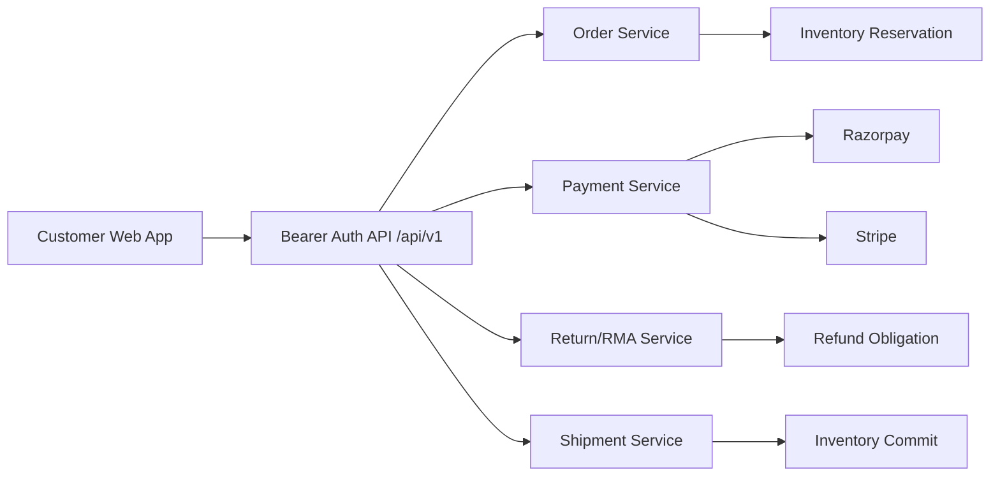
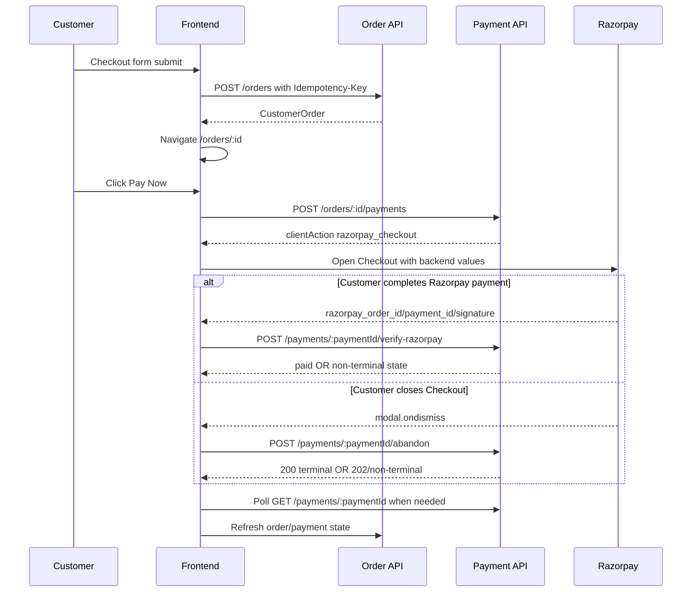
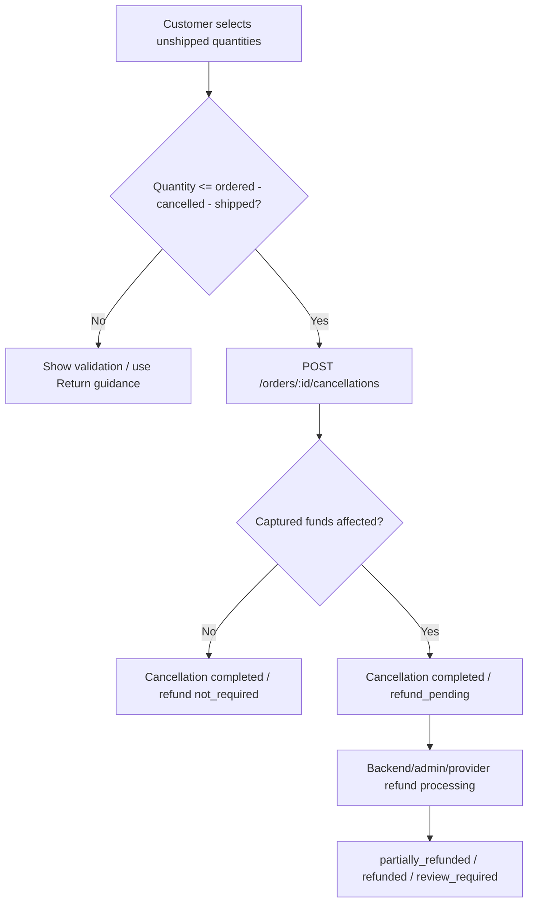
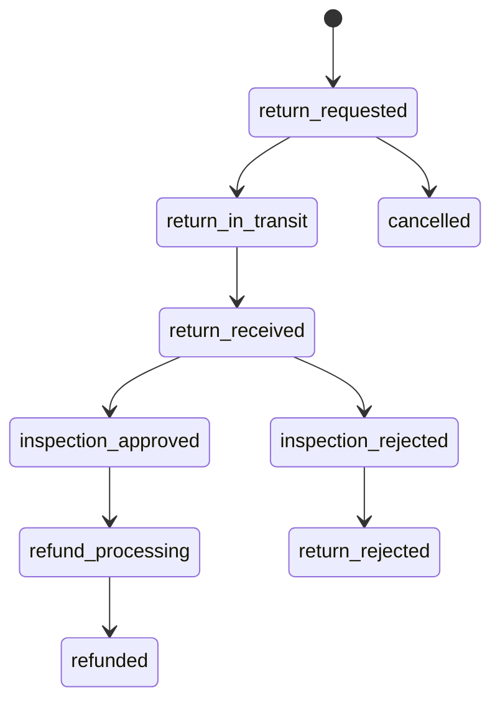

# EcoCaret Order Management Workflow

Production reference for the customer storefront order workflow covering orders, payments, cancellations, returns/RMA, refunds, shipments, permissions, API contracts, validation, and frontend implementation guidance.

This README documents the customer-facing frontend in this repository and the backend API contract it consumes under `/api/v1`.

## Table of Contents

- [System Overview](#system-overview)
- [Actors and RBAC](#actors-and-rbac)
- [Core Domain Rules](#core-domain-rules)
- [Status Models](#status-models)
- [End-to-End Workflow](#end-to-end-workflow)
- [Customer APIs](#customer-apis)
- [Admin APIs](#admin-apis)
- [Frontend Implementation Guide](#frontend-implementation-guide)
- [Validation and Error Handling](#validation-and-error-handling)
- [Idempotency](#idempotency)
- [Security and Compliance Rules](#security-and-compliance-rules)
- [Testing Checklist](#testing-checklist)
- [Operations and Release Notes](#operations-and-release-notes)
- [Detailed Checkout Guide](#detailed-checkout-guide)

## System Overview

EcoCaret uses a backend-authoritative order workflow. The frontend never calculates final payable or refundable amounts, never marks payments/refunds complete locally, and never calls admin-only refund or inspection endpoints.



### Repositories

| Area | Repository/Path | Notes |
| --- | --- | --- |
| Customer frontend | `D:\RetakeSolution\ecocaret` | Next.js App Router storefront. |
| Backend order module | `D:\RetakeSolution\jewlery-BE` | Express/Mongoose API and order workflow. |
| Frontend API client | `services/api.ts` | Uses `apiClient` with bearer token injection. |
| Frontend order detail page | `app/orders/[id]/page.tsx` | Order, payment, cancellation, return, shipment UI. |
| Frontend types | `types/api.ts` | Customer-safe DTO contracts. |
| Detailed checkout doc | `CHECK_OUT.md` | Full checkout, payment recovery, order action, and customer ledger guide. |

## Actors and RBAC

Customer APIs require authentication and ownership. Admin APIs require RBAC permissions.

| Role | Permissions | Order Access |
| --- | --- | --- |
| `viewer` | none | Customer-owned `/orders/*` only. |
| `catalog_manager` | catalog/product permissions | No order access by default. |
| `admin` | `orders:read`, `orders:manage`, `payments:read`, `payments:manage`, `refunds:manage` | Admin order/payment/refund operations. |
| `super_admin` | all permissions | Full admin access. |

Permissions currently defined by backend RBAC:

| Permission | Purpose |
| --- | --- |
| `orders:read` | Admin order, event, shipment, return reads. |
| `orders:manage` | Admin order mutation, shipment, return transition operations. |
| `payments:read` | Admin payment read operations. |
| `payments:manage` | Admin payment capture/void/reconciliation operations. |
| `refunds:manage` | Admin refund processing operations. |

Customer routes must never expose cross-customer data. Missing and unauthorized owned-resource lookups should both resolve to a safe `404`.

## Core Domain Rules

| Rule | Contract |
| --- | --- |
| Amounts | All money values are integer minor units, formatted in the frontend with backend `currency`. |
| Order pricing | Backend authoritative. Frontend does not submit final amount, tax, shipping, refund, capture, or provider metadata. |
| Payment proof | Browser redirects/callbacks are not proof. Backend verification/webhook/provider retrieval is authoritative. |
| Checkout dismissal | Closing Razorpay Checkout is not payment failure; the frontend reports abandonment and polls backend status. |
| Refund proof | Customer frontend never starts Razorpay/Stripe refunds and never marks refunds complete. |
| Inventory reservation | Reserved at order creation; released by valid unshipped cancellation; committed when shipment reaches shipped. |
| Cancellation scope | Only unshipped quantity can be cancelled. Shipped quantity must use Return/RMA. |
| Return scope | Only shipped quantity minus already returned and active outstanding returns can be requested. |
| Refund lifecycle | Cancellation/return may complete first, with refund tracked asynchronously as `refund_pending` or later states. |
| Shipment gating | Shipment requires a valid paid/covered financial state and no active payment attempt conflict. |

## Status Models

### Order Fulfillment Status

| Status | Meaning | Notes |
| --- | --- | --- |
| `pending` | Order created, awaiting confirmation/payment/processing. | Customer order exists. |
| `confirmed` | Order accepted for fulfillment. | May still be unshipped. |
| `crafting` | Production in progress. | Unshipped quantities may remain cancellable. |
| `quality_check` | Inspection before shipping. | Unshipped quantities may remain cancellable. |
| `ready_to_ship` | Fulfillment can create shipments. | Shipment allocation rules apply. |
| `partially_shipped` | Some quantity shipped. | Mixed cancellation and return actions may both be visible. |
| `shipped` | All active shippable quantity shipped. | Return workflow becomes relevant. |
| `partially_delivered` | Some shipments delivered. | Return workflow remains by shipped quantities. |
| `delivered` | Delivered. | Returns may still be requested per policy. |
| `cancelled` | All order quantity cancelled. | Payment action hidden. |

### Payment Status

| Status | Customer Meaning | Pay Now? |
| --- | --- | --- |
| `pending` | Payment required. | Yes if `amountDueMinor > 0`. |
| `created` / `requires_action` | Provider action required. | Yes/resume if active payment exists. |
| `processing` / `unknown` | Backend/provider verification in progress. | No new attempt; poll/read backend. |
| `authorized` | Payment authorized but not captured. | Usually no new attempt; backend controls capture/void. |
| `paid` | Payment verified. | No. |
| `not_required` | No customer payment required. | No. |
| `failed` | Attempt failed. | Yes if order still payable. |
| `cancelled` / `expired` | Attempt closed. | Yes if order still payable. |
| `refund_pending` | Cancellation/return refund obligation exists. | No. |
| `partially_refunded` | Some refund completed. | No. |
| `refunded` | Refund completed. | No. |
| `disputed` | Payment dispute exists. | No. |
| `review_required` | Support/finance review required. | No. |

### Cancellation Refund Status

| Status | Meaning |
| --- | --- |
| `not_required` | No captured funds affected. |
| `refund_pending` | Cancellation completed; refund will be processed asynchronously. |
| `partially_refunded` | Part of the refund is complete. |
| `refunded` | Refund completed. |
| `review_required` | Manual support/finance review is required. |

### Return/RMA Status

| Status | Customer Label | Allowed Actor |
| --- | --- | --- |
| `return_requested` | Return requested | Customer creates; admin reads/transitions. |
| `return_in_transit` | Return in transit | Admin/carrier workflow. |
| `return_received` | Received by warehouse | Admin only. |
| `inspection_approved` | Inspection approved | Admin only. |
| `inspection_rejected` | Inspection rejected | Admin only. |
| `refund_processing` | Refund processing | System/admin refund workflow. |
| `refunded` | Refund completed | Provider/backend authoritative. |
| `return_rejected` | Return rejected | Admin only. |
| `cancelled` | Return cancelled | Admin/system policy. |

### Return Refund Status

| Status | Meaning |
| --- | --- |
| `not_eligible` | No refund currently eligible. |
| `refund_pending` | Refund obligation exists and is pending processing. |
| `partially_refunded` | Some refund completed. |
| `refunded` | Refund completed. |
| `review_required` | Manual review required. |

### Shipment Status

| Status | Meaning | Inventory Impact |
| --- | --- | --- |
| `pending` | Shipment draft/created. | Allocation may exist; not committed. |
| `label_created` | Carrier label created. | Allocation remains. |
| `shipped` | Carrier has shipment. | Stocked inventory commits. |
| `in_transit` | Carrier transit. | Already committed. |
| `delivered` | Delivered. | Return eligibility may apply. |
| `exception` | Carrier issue. | Requires operational review. |
| `cancelled` | Shipment cancelled before terminal shipping. | Allocation may release if allowed. |

## End-to-End Workflow

### Order Creation to Payment



Payment rules:

- Create-payment request body contains only `{ channel: "web", returnPath: "order-status", provider: "razorpay" }`.
- Frontend does not submit amount, currency, capture method, user ID, callback URL, provider secret, or refund details.
- Razorpay success payload is mapped from snake_case to backend camelCase.
- Paid UI appears only after backend verification returns `paid` or refreshed order state shows paid.
- Razorpay `ondismiss` is handled through the backend abandon endpoint; the frontend must not mark the payment failed locally.
- The internal backend payment ID is used for verify, abandon, and status URLs. Do not substitute Razorpay provider IDs.
- While payment is busy, polling, or reconciling, Pay Now and customer cancellation are disabled.

### Cancellation-First Refund Flow



Cancellation rules:

- `cancelableQuantity = orderedQuantity - cancelledQuantity - shippedQuantity`.
- Shipped quantity is never converted silently into a return.
- For complete remaining unshipped cancellation, frontend may omit `items`.
- For mixed shipped/unshipped orders, frontend sends explicit item quantities.
- Cancellation success does not require refund success.
- Returned cancellation response should be preserved in UI state so refund information remains visible after mutation.

### Return/RMA Flow



Return rules:

- `returnableQuantity = shippedQuantity - returnedQuantity - outstandingActiveReturnQuantity`.
- Active return states are `return_requested`, `return_in_transit`, `return_received`, `inspection_approved`, and `refund_processing`.
- Outstanding active quantity is `requested quantity - received quantity`.
- Customers can create/read returns but cannot receive, inspect, approve, reject, or refund returns.

## Customer APIs

All customer APIs require bearer authentication via the existing API client.

### Create Order

```http
POST /api/v1/orders
Authorization: Bearer <token>
Content-Type: application/json
Idempotency-Key: <uuid>
```

```json
{
  "items": [
    {
      "productId": "6a39315af42197559d59d72a",
      "metalType": "gold",
      "metalColor": "yellow",
      "purity": "18K",
      "size": "7",
      "quantity": 1
    }
  ],
  "shippingAddress": {
    "name": "Test User",
    "line1": "1 Main Street",
    "city": "London",
    "state": "London",
    "postalCode": "W1A 1AA",
    "country": "GB",
    "phone": "+441234567890"
  },
  "billingAddress": {
    "name": "Test User",
    "line1": "1 Main Street",
    "city": "London",
    "state": "London",
    "postalCode": "W1A 1AA",
    "country": "GB",
    "phone": "+441234567890"
  }
}
```

### List Orders

```http
GET /api/v1/orders?page=1&limit=20&fulfillmentStatus=pending&paymentStatus=paid&search=ORD
Authorization: Bearer <token>
```

### Get Order

```http
GET /api/v1/orders/:orderId
Authorization: Bearer <token>
```

### Order Events

```http
GET /api/v1/orders/:orderId/events?afterSequence=120&limit=50
Authorization: Bearer <token>
```

Uses sequence cursor pagination. Do not assume offset pagination.

### Shipments

```http
GET /api/v1/orders/:orderId/shipments?limit=20&cursor=<opaque>
Authorization: Bearer <token>
```

Customer shipment DTO is allowlisted: carrier, service, tracking number/URL, status, item quantities, and safe dates only.

### Create Payment

```http
POST /api/v1/orders/:orderId/payments
Authorization: Bearer <token>
Content-Type: application/json
Idempotency-Key: <stable-uuid>
```

```json
{
  "channel": "web",
  "returnPath": "order-status",
  "provider": "razorpay"
}
```

### Verify Razorpay Payment

```http
POST /api/v1/orders/:orderId/payments/:paymentId/verify-razorpay
Authorization: Bearer <token>
Content-Type: application/json
```

```json
{
  "razorpayOrderId": "order_...",
  "razorpayPaymentId": "pay_...",
  "razorpaySignature": "..."
}
```

### List/Get Payments

```http
GET /api/v1/orders/:orderId/payments
GET /api/v1/orders/:orderId/payments/:paymentId
Authorization: Bearer <token>
```

### Abandon/Dismiss Razorpay Payment

Used when the Razorpay Checkout modal is closed before a success callback.

```http
POST /api/v1/orders/:orderId/payments/:paymentId/abandon
Authorization: Bearer <token>
Content-Type: application/json
Idempotency-Key: payment-abandon:<paymentId>
```

```json
{}
```

Response can be `200` when the backend has reconciled provider state, or `202` when reconciliation is still pending.

Frontend behavior:

| Result | Frontend Behavior |
| --- | --- |
| `paid` | Stop polling, refresh order, continue successful-payment flow. |
| `failed` / `cancelled` / `expired` | Stop polling, show "Payment was not completed.", refresh order, allow retry only if order is otherwise payable. |
| `created` / `requires_action` / `processing` / `authorized` / `unknown` / `review_required` | Keep retry and cancellation disabled; continue polling. |
| HTTP `202` | Start polling the existing payment-status endpoint. |
| API error | Do not mark failed locally; show warning and poll status when possible. |

### Cancel Unshipped Items

```http
POST /api/v1/orders/:orderId/cancellations
Authorization: Bearer <token>
Content-Type: application/json
Idempotency-Key: <stable-uuid>
```

Full unshipped cancellation may omit `items`:

```json
{
  "expectedVersion": 7,
  "reason": "Changed my mind"
}
```

Partial/mixed cancellation sends explicit quantities:

```json
{
  "expectedVersion": 7,
  "reason": "Only need one item",
  "items": [
    {
      "orderItemId": "66f...",
      "quantity": 1
    }
  ]
}
```

Response:

```json
{
  "success": true,
  "data": { "id": "order-id", "paymentStatus": "refund_pending" },
  "cancellation": {
    "id": "cancellation-id",
    "orderId": "order-id",
    "items": [
      {
        "orderItemId": "66f...",
        "quantity": 1,
        "refundAmountMinor": 12500
      }
    ],
    "status": "completed",
    "refundStatus": "refund_pending",
    "refundAmountMinor": 12500,
    "refundedMinor": 0,
    "reason": "Only need one item"
  }
}
```

### Create Return

```http
POST /api/v1/orders/:orderId/returns
Authorization: Bearer <token>
Content-Type: application/json
Idempotency-Key: <stable-uuid>
```

```json
{
  "expectedOrderVersion": 7,
  "reason": "Size does not fit",
  "items": [
    {
      "orderItemId": "66f...",
      "quantity": 1
    }
  ]
}
```

### List Returns

```http
GET /api/v1/orders/:orderId/returns?limit=20&cursor=<opaque>
Authorization: Bearer <token>
```

Response:

```json
{
  "success": true,
  "data": [
    {
      "id": "return-id",
      "orderId": "order-id",
      "items": [
        {
          "orderItemId": "66f...",
          "quantity": 1,
          "receivedQuantity": 0,
          "approvedQuantity": 0,
          "refundAmountMinor": 0
        }
      ],
      "reason": "Size does not fit",
      "status": "return_requested",
      "refundStatus": "not_eligible",
      "refundAmountMinor": 0,
      "refundedMinor": 0,
      "version": 1
    }
  ],
  "pagination": {
    "limit": 20,
    "hasMore": false
  }
}
```

### Get Return

```http
GET /api/v1/orders/:orderId/returns/:returnId
Authorization: Bearer <token>
```

Customer return responses must not expose private inspection notes, warehouse disposition, provider refund IDs, internal idempotency records, or admin-only audit metadata.

## Admin APIs

Admin APIs require bearer authentication plus RBAC.

| Method | Path | Permission | Purpose |
| --- | --- | --- | --- |
| `GET` | `/api/v1/admin/orders` | `orders:read` | List all orders. |
| `GET` | `/api/v1/admin/orders/:id` | `orders:read` | Admin order detail. |
| `GET` | `/api/v1/admin/orders/:id/events` | `orders:read` | Full safe event stream. |
| `GET` | `/api/v1/admin/orders/:id/shipments` | `orders:read` | Shipment list. |
| `POST` | `/api/v1/admin/orders/:id/cancellations` | `orders:manage` | Admin cancellation. |
| `GET` | `/api/v1/admin/orders/:id/returns` | `orders:read` | Return list. |
| `GET` | `/api/v1/admin/orders/:id/returns/:returnId` | `orders:read` | Return detail. |
| `PATCH` | `/api/v1/admin/orders/:id/returns/:returnId/transit` | `orders:manage` | Mark return in transit. |
| `POST` | `/api/v1/admin/orders/:id/returns/:returnId/receive` | `orders:manage` | Receive returned items. |
| `POST` | `/api/v1/admin/orders/:id/returns/:returnId/inspections` | `orders:manage` | Approve/reject inspection. |
| `PATCH` | `/api/v1/admin/orders/:id/fulfillment-status` | `orders:manage` | Controlled fulfillment update. |
| `PATCH` | `/api/v1/admin/orders/:id/items/:itemId/fulfillment-status` | `orders:manage` | Controlled item update. |
| `POST` | `/api/v1/admin/orders/:id/shipments` | `orders:manage` | Create shipment. |
| `PATCH` | `/api/v1/admin/orders/:id/shipments/:shipmentId` | `orders:manage` | Shipment transition/update. |
| `GET` | `/api/v1/admin/payments` | `payments:read` | Payment operations list. |
| `POST` | admin refund endpoints | `refunds:manage` | Provider-aware refund processing. |

## Frontend Implementation Guide

### Files

| File | Responsibility |
| --- | --- |
| `services/apiClient.ts` | Axios instance and bearer token injection. |
| `services/api.ts` | Typed customer API methods. |
| `types/api.ts` | Customer DTOs and status unions. |
| `lib/idempotency.ts` | Stable idempotency key generation/storage. |
| `lib/paymentStatusRules.ts` | Shared payment terminal/pollable status helpers. |
| `lib/razorpayCheckout.ts` | Browser-only Razorpay loader and callback mapping. |
| `hooks/useRazorpayPayment.ts` | Payment creation, provider action, verification, dismiss/abandon, polling, manual status checks. |
| `app/checkout/page.tsx` | Auth-gated checkout form, order creation, cart-to-order payload mapping, redirect to order detail. |
| `app/orders/[id]/page.tsx` | Order detail, payment, cancellation, return, shipment UI. |
| `components/OrderTimeline.tsx` | Compact order event timeline. |
| `CHECK_OUT.md` | Expanded checkout and order workflow documentation. |

### Payment UI Rules

Show `Pay Now` only when all are true:

- `amountDueMinor > 0`
- order is not fully cancelled
- reservation-expired rule does not block payment
- payment status is not `paid`, `not_required`, `refund_pending`, `partially_refunded`, `refunded`, `disputed`, `review_required`, or `cancelled`
- `useRazorpayPayment` is not `busy`, `polling`, or `reconciling`

Payment recovery rules:

- Payment attempt details are stored in `sessionStorage` per order.
- If `PAYMENT_ACTIVE_ATTEMPT_EXISTS` occurs, recover the latest active Razorpay payment instead of blindly creating another attempt.
- Razorpay success sets `paymentCallbackStartedRef` before backend verification to prevent abandon races.
- Razorpay dismiss sets `abandonmentStartedRef` and calls `/abandon` once with `payment-abandon:<paymentId>`.
- Poll payment status every 2.5-3 seconds for up to 60 seconds when provider reconciliation is pending.
- Use `AbortController` to cancel in-flight payment-status requests during cleanup/unmount.
- On polling timeout, keep the payment non-terminal and show manual `Check payment status`; do not enable retry solely because of timeout.

### Cancellation UI Rules

For each item:

```ts
cancelableQuantity = ordered - cancelled - shipped;
```

Display `Cancel Unshipped Items` when at least one item has `cancelableQuantity > 0`.

Do not submit quantities above the calculated max. If any shipped quantity exists, show return guidance rather than converting it.

### Return UI Rules

For each item:

```ts
returnableQuantity =
  shipped
  - returned
  - outstandingActiveReturnQuantity;
```

Where:

```ts
outstandingActiveReturnQuantity =
  sum(activeReturnItem.quantity - activeReturnItem.receivedQuantity);
```

Display `Request Return` when at least one item has `returnableQuantity > 0`.

### Pagination Rules

| Resource | Cursor | Rule |
| --- | --- | --- |
| Events | `afterSequence` | Sequence cursor; append reversed/new rows carefully. |
| Shipments | `cursor` | Opaque cursor; never decode in frontend. |
| Returns | `cursor` | Opaque cursor; append only non-duplicate return IDs. |

## Validation and Error Handling

| Error/Condition | Frontend Behavior |
| --- | --- |
| `401` | Prompt sign-in/session expired message. |
| `404` | Show unavailable without leaking ownership. |
| `429` | Show retry-later message. |
| `ORDER_RETURN_REQUIRED` | Explain shipped quantities must use Request Return. |
| `ORDER_VERSION_CONFLICT` | Refresh order and returns; require explicit resubmission. |
| `PAYMENT_CANCELLATION_REQUIRED` | Explain active payment must finish/expire before cancellation. |
| `PAYMENT_VOID_REQUIRED` | Explain payment authorization must be released before cancellation. |
| `ORDER_RESERVATION_RELEASE_CONFLICT` | Refresh order; require explicit retry. |
| `ORDER_SHIPMENT_QUANTITY_CONFLICT` | Refresh order; require explicit retry. |
| `ORDER_RETURN_QUANTITY_CONFLICT` | Refresh order and return list; require explicit retry. |
| Razorpay Checkout dismissed | Call `/payments/:paymentId/abandon`; show "Payment window closed. We're checking your payment status." |
| Abandon request failed | Do not mark failed locally; show "We could not confirm the payment status yet. Please wait or check your order status." and poll when possible. |
| Payment polling timeout | Keep payment non-terminal; show "Payment verification is taking longer than expected. Check your order status before retrying." |
| Validation errors | Keep modal open and show safe message. |
| Network timeout | Preserve idempotency key for retry of same payload. |
| Provider unavailable | Preserve payment attempt state; allow safe retry where applicable. |

## Idempotency

Mutation endpoints use `Idempotency-Key`.

| Operation | Key Scope | Storage |
| --- | --- | --- |
| Order creation | one checkout submission | component/session state |
| Payment creation | one order payment attempt | `sessionStorage` per order |
| Payment abandonment | one Razorpay dismiss for the internal payment id | `payment-abandon:<paymentId>` |
| Cancellation | one logical cancellation payload | `sessionStorage` key `eco_caret_cancel_<orderId>` |
| Return creation | one logical return payload | `sessionStorage` key `eco_caret_return_<orderId>` |

Rules:

- Use `crypto.randomUUID()` when available.
- Reuse the key for retry of the same logical request.
- Clear the key only after definitive backend response.
- Clear/generate a new key when the customer edits payload and starts a new operation.
- Never use timestamps alone.

## Security and Compliance Rules

| Requirement | Rule |
| --- | --- |
| Secrets | No Razorpay/Stripe secrets in frontend env or source. |
| Provider callbacks | Never trust browser-only payment/refund callback. |
| Refunds | Customer frontend never calls provider/admin refund endpoints. |
| Admin-only data | Do not expose inspection notes, warehouse disposition, provider refund IDs, or idempotency internals. |
| Ownership | Customer reads and mutations must be scoped by authenticated user. |
| Amounts | Backend amount/currency/refund values are authoritative. |
| URLs | Do not submit arbitrary callback/return URLs for payment creation. |
| Logs | Do not log signatures, provider payloads, tokens, or customer-sensitive details. |

## Testing Checklist

The repo includes a focused Node test for Razorpay payment status and abandon rules at `tests/razorpay-payment-rules.test.mts`. Keep expanding coverage as checkout and order behavior grows. Required coverage:

| Area | Test |
| --- | --- |
| Cancellation quantity | `ordered - cancelled - shipped` is used. |
| Shipped items | Shipped quantities are never offered for cancellation. |
| Mixed orders | Cancellation and return actions show independently. |
| Cancellation success | `refund_pending` is treated as successful cancellation. |
| Return guidance | `ORDER_RETURN_REQUIRED` displays return guidance. |
| Return creation | Sends `expectedOrderVersion` and `Idempotency-Key`. |
| Duplicate clicks | Disabled pending buttons prevent duplicate mutation. |
| Retry | Same idempotency key reused after network failure. |
| Return pagination | Cursor pagination appends without duplicates. |
| Customer DTO safety | No inspection notes/internal IDs/provider refund IDs exposed. |
| Payment gating | Pay Now hidden for refund-related states. |
| Razorpay dismiss | Calls abandon endpoint once with internal payment id and stable idempotency key. |
| Razorpay success race | Success callback prevents abandonment before backend verification starts. |
| Payment polling | HTTP 202 and non-terminal statuses keep retry/cancellation disabled and poll status. |
| Polling timeout | Keeps payment non-terminal and exposes manual status check. |
| Cleanup | Timers and in-flight payment-status requests are cleaned up on unmount. |
| Provider refunds | Frontend never calls Razorpay/Stripe refund APIs. |
| States | Loading, empty, validation, conflict, rate-limit, server error. |

Validation commands used in this repo:

```bash
npx.cmd tsc --noEmit --pretty false
npm.cmd run lint
node --test tests/razorpay-payment-rules.test.mts
npm.cmd run build
```

Known build caveat: `next build` can fail in restricted-network environments while fetching Google Fonts through `next/font` from `fonts.googleapis.com`.

## Operations and Release Notes

Production readiness requires:

1. MongoDB replica-set transaction support.
2. Inventory/reservation migrations reviewed, backed up, and reconciled.
3. Payment provider test/live credentials and webhooks configured.
4. Recurring workers for payment/refund processing and reconciliation.
5. Return/RMA operational process for transit, receipt, and inspection.
6. Monitoring for outbox, payment webhooks, refund pending backlog, and reservation expiry.
7. Source and compiled backend `dist` parity before deployment.

## Developer Guidelines

- Keep customer and admin APIs separate.
- Reuse `services/api.ts` and typed DTOs; do not use ad hoc fetch calls.
- Keep all money in minor units until formatting for display.
- Refresh order and return list after cancellation or return mutation.
- Refresh order after paid, terminal payment, cancellation, return conflict, or payment reconciliation completion.
- Treat stale versions as a user-visible retry condition, not an automatic resubmit.
- Preserve Razorpay/Stripe support; do not remove provider-aware code.
- Add abstractions only where they reduce duplication or enforce business rules.

## Detailed Checkout Guide

For the expanded customer checkout and order-status implementation guide, see [`CHECK_OUT.md`](CHECK_OUT.md).

That document includes:

- `/checkout` authentication, empty cart, validation, address mapping, and place-order behavior.
- Cart item parsing into `PlaceOrderPayload`.
- Order detail payment entry rules.
- Razorpay success, dismiss, abandon, polling, timeout, and manual status-check flow.
- Cancellation, return, refund, shipment, invoice, and timeline behavior.
- Endpoint examples, payload examples, status tables, and frontend safety rules.
