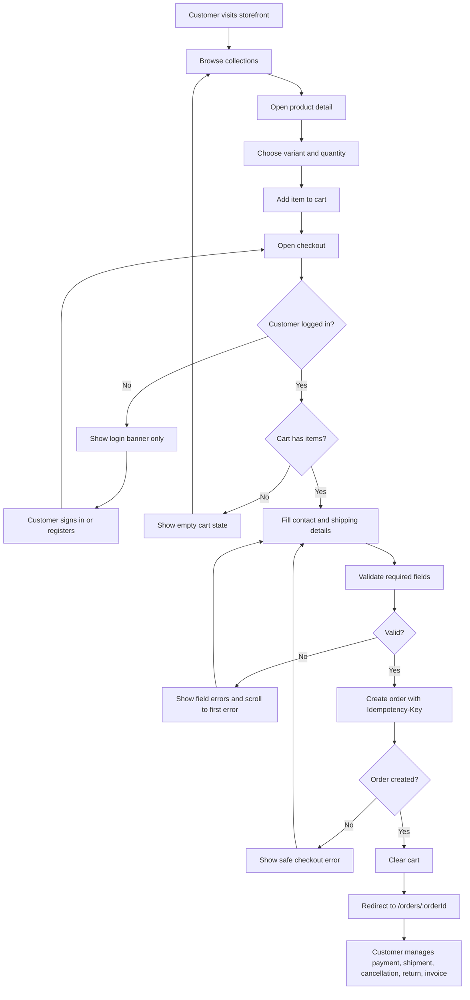
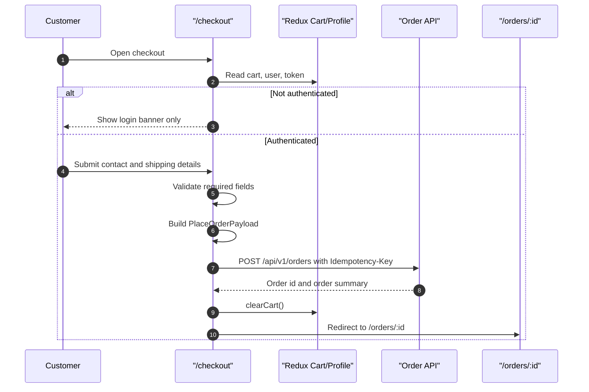
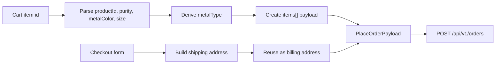
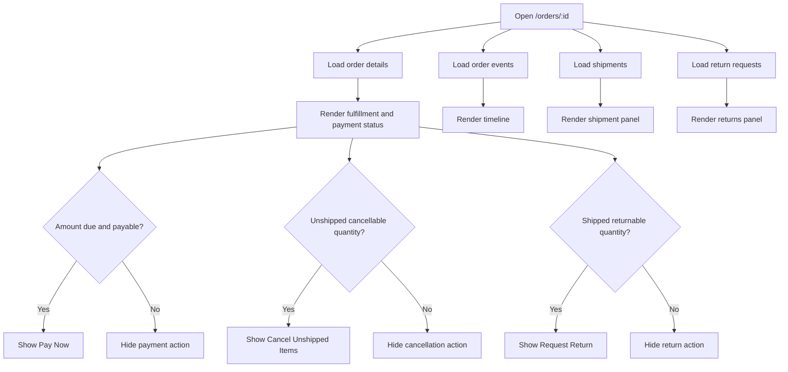
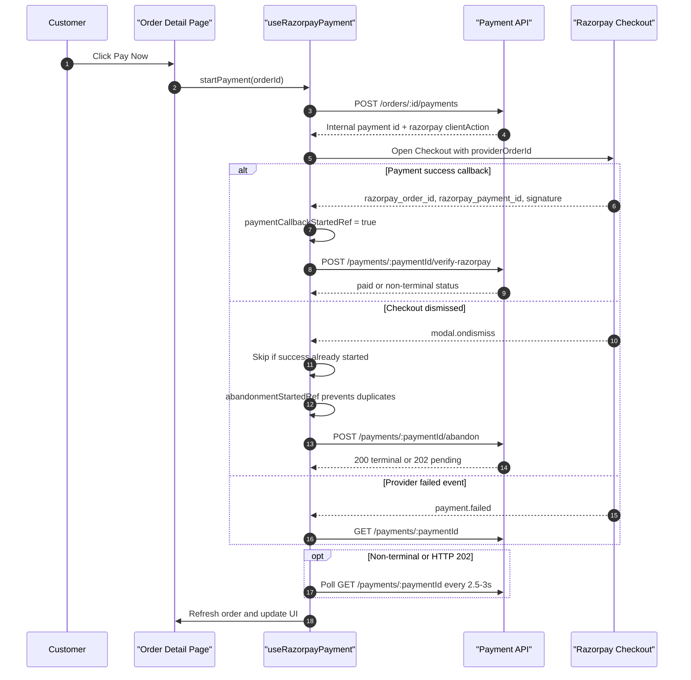
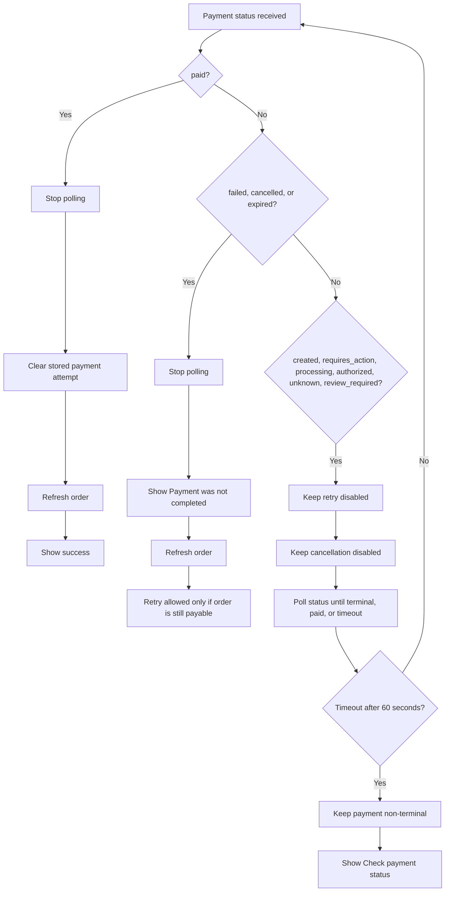
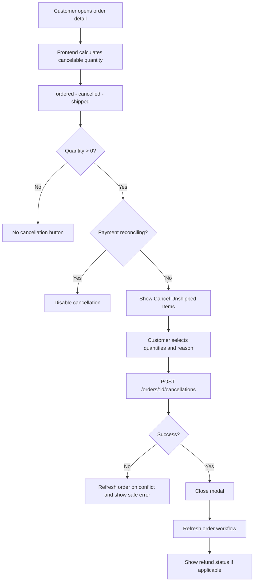
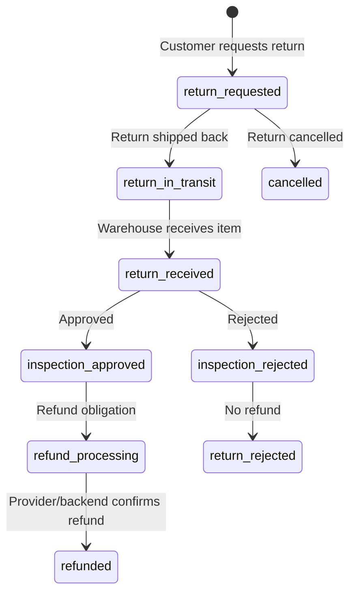
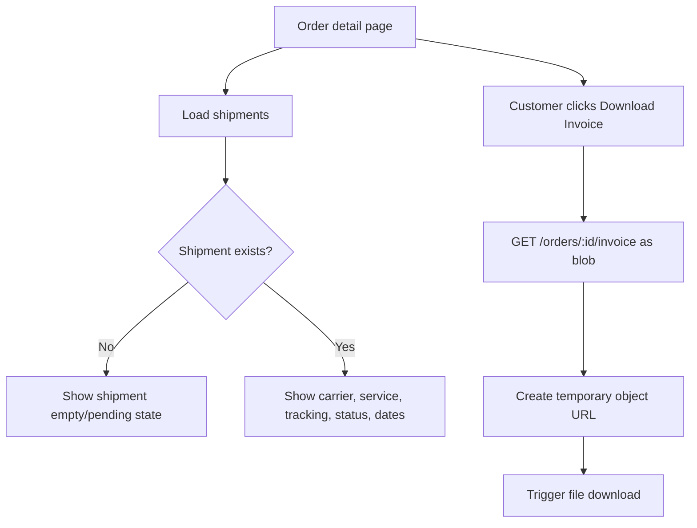
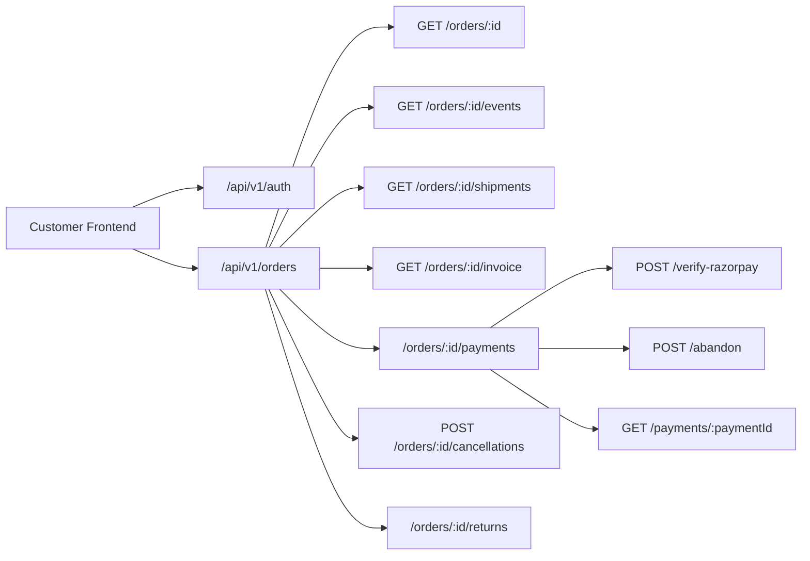

# Eco Caret Customer Workflow README

This file gives a visual understanding of the customer storefront workflow in the Eco Caret frontend.

Use this as the quick workflow map. For deeper contracts and payload examples, see:

- `README.md` for the full order-management reference.
- `CHECK_OUT.md` for the detailed checkout and order-status guide.

## Workflow Scope

This workflow covers:

- Browse products and add items to cart.
- Checkout authentication and address entry.
- Order creation with idempotency.
- Order detail ledger.
- Razorpay payment creation, success, dismissal, reconciliation, and retry.
- Customer cancellation for unshipped quantities.
- Customer return request for shipped quantities.
- Refund status tracking.
- Shipment, timeline, and invoice reads.

## Main Customer Journey



## Checkout To Order Creation

Checkout creates an order first. Payment happens after redirect on the order detail page.



## Checkout Payload Understanding



Key rules:

| Area | Rule |
| --- | --- |
| Final totals | Backend is authoritative after order creation. |
| Cart summary | Checkout display total is only a preview. |
| Idempotency | Same checkout submission reuses the same key until success or mismatch. |
| Auth | Order creation requires bearer authentication. |
| Success | Cart is cleared only after order creation succeeds. |

## Order Detail Page Workflow

The order detail page is the customer ledger. It is the place where the customer pays, checks status, downloads invoices, cancels unshipped items, requests returns, and views shipments.



## Razorpay Payment Workflow

Payment is created against an existing order. The internal backend payment id must be used for all frontend API calls.



## Payment Status Decision Tree



## Payment Safety Guards

| Guard | Purpose |
| --- | --- |
| `paymentCallbackStartedRef` | Prevents abandon request after Razorpay success starts. |
| `abandonmentStartedRef` | Prevents duplicate abandon requests from repeated dismiss callbacks. |
| `activeCheckoutRef` | Prevents multiple Checkout windows. |
| `verifyingRef` | Prevents overlapping backend verification. |
| `pollRequestInFlightRef` | Prevents overlapping payment-status polling requests. |
| `AbortController` | Cleans up payment-status request on stop/unmount. |
| `reconciling` | Locks Pay Now and cancellation while payment status is uncertain. |

## Order Cancellation Workflow

Cancellation applies only to unshipped quantities.



Cancellation payload:

```json
{
  "reason": "Customer requested cancellation",
  "expectedVersion": 12,
  "items": [
    {
      "orderItemId": "order-item-id",
      "quantity": 1
    }
  ]
}
```

## Return And Refund Workflow

Returns apply to shipped quantities. Refund is backend/provider authoritative and may happen after inspection.



Returnable quantity:

```ts
returnableQuantity =
  shipped
  - returned
  - outstandingActiveReturnQuantity;
```

Return payload:

```json
{
  "expectedOrderVersion": 12,
  "reason": "Size issue",
  "items": [
    {
      "orderItemId": "order-item-id",
      "quantity": 1
    }
  ]
}
```

Refund statuses shown to the customer:

| Status | Customer meaning |
| --- | --- |
| `not_required` / `not_eligible` | Refund is not required or not eligible. |
| `refund_pending` | Refund obligation exists and is waiting. |
| `partially_refunded` | Some amount has been refunded. |
| `refunded` | Refund is complete. |
| `review_required` | Support or finance review is required. |

## Shipment And Invoice Workflow



Shipment and invoice rules:

| Area | Rule |
| --- | --- |
| Shipment source | Backend shipment DTO only. |
| Tracking | Show customer-safe carrier and tracking data. |
| Inventory | Frontend does not commit inventory locally. |
| Invoice | Downloaded as a blob from backend. |

## API Map



## Frontend File Responsibility

| File | Responsibility |
| --- | --- |
| `app/checkout/page.tsx` | Auth gate, checkout form, cart summary, order creation, redirect to order detail. |
| `app/orders/page.tsx` | Customer order list. |
| `app/orders/[id]/page.tsx` | Order ledger, payment UI, cancellation, returns, shipments, invoice, timeline. |
| `services/api.ts` | Typed API functions for orders, payments, returns, shipment, invoice. |
| `hooks/useRazorpayPayment.ts` | Payment attempt creation, verification, abandon, polling, manual status check. |
| `lib/razorpayCheckout.ts` | Razorpay script loading and Checkout configuration. |
| `lib/paymentStatusRules.ts` | Shared payment status helper rules. |
| `lib/idempotency.ts` | Stable idempotency key helper for mutations. |
| `types/api.ts` | Shared frontend DTO and status types. |

## Important Rules To Remember

- Checkout creates the order; payment is handled from order detail.
- Browser payment callbacks are not proof of payment.
- Closing Razorpay Checkout is not payment failure.
- Always use the internal backend payment id for payment API URLs.
- Do not create another payment while the current one is non-terminal.
- Do not allow cancellation while payment status is being reconciled.
- Backend totals, refund values, shipment state, and payment status are authoritative.
- Customer frontend never calls admin-only refund or inspection endpoints.

## Validation

Recommended validation after workflow changes:

```bash
npx.cmd tsc --noEmit --pretty false
npm.cmd run lint
node --test tests/razorpay-payment-rules.test.mts
npm.cmd run build
```

Known note: `npm.cmd run build` may need network access because Next.js fetches Google Fonts during production build.
